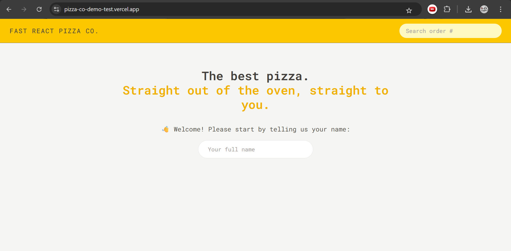
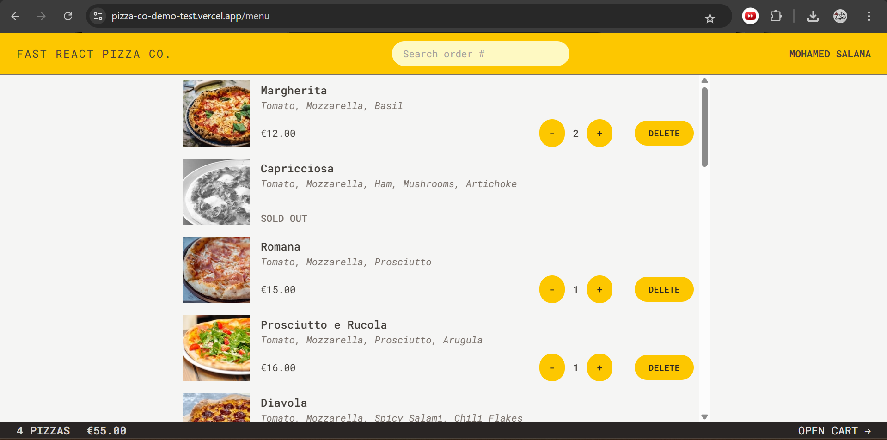
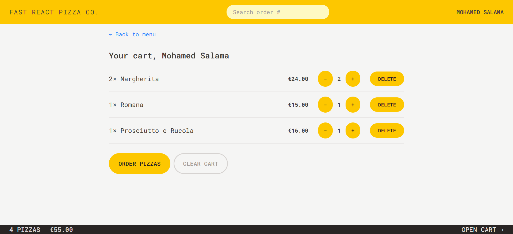
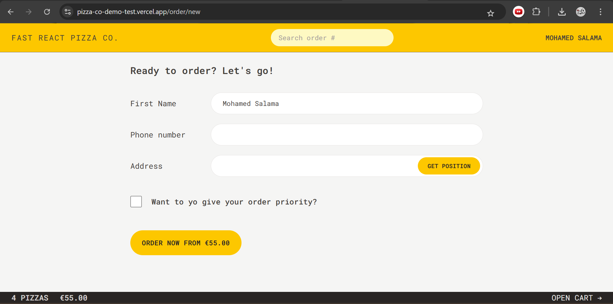
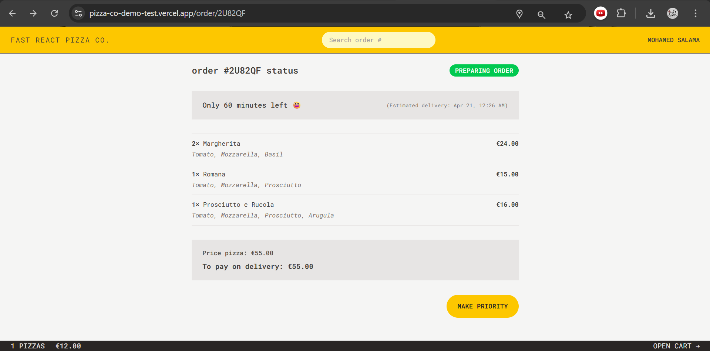

# 🍕 Fast React Pizza Co.

A modern and responsive pizza ordering web application built with **React + Vite**.
The app allows users to browse pizzas, manage their cart, place orders, and track delivery status in a smooth and intuitive experience.

---

## 🚀 Live Demo

👉 https://pizza-co-demo-test.vercel.app/

---

## 📸 Screenshots

### 🏠 Home



### 🍕 Menu



### 🛒 Cart



### 🧾 Order Form



### 📦 Order Status



---

## ✨ Features

* User name input to start ordering
* Browse pizza menu with ingredients and pricing
* Sold-out items handling
* Add and remove items from cart
* Real-time cart updates
* Order placement with user details
* Priority order option for faster delivery
* Search orders by ID
* Live order tracking with estimated delivery time
* Fully responsive design

---

## 🛠️ Tech Stack

* React 19
* Vite
* React Router
* Redux Toolkit
* React Redux
* Tailwind CSS
* ESLint + Prettier

---

## 📁 Project Structure

```bash id="c3j2yq"
src/
 ├── features/
 ├── services/
 ├── ui/
 ├── utils/
 ├── App.jsx
 ├── main.jsx
 ├── index.css
 └── store.js
```

---

## ⚙️ Installation

```bash id="ybg4tx"
git clone https://github.com/your-username/pizza-co.git
cd pizza-co
npm install
npm run dev
```

---

## 📦 Build

```bash id="2xjz9u"
npm run build
```

---

## 👀 Preview

```bash id="4flp6y"
npm run preview
```

---

## 🚀 Deployment

This project is deployed on **Vercel** and configured as a Single Page Application (SPA), ensuring all routes work correctly even after refresh.

---

## 💡 Notes

* Clean and minimal UI design
* Fast performance powered by Vite
* State management using Redux Toolkit
* Responsive across all devices

---

## 👨‍💻 Author

**Mohamed Salama**
